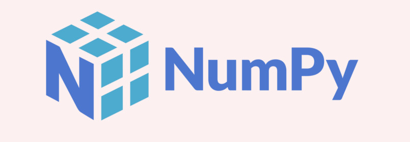

# Aprenda Numpy

> Neste repositório eu reuno alguns materiais interessantes sobre a biblioteca Numpy que podem ser úteis se você está aprendendo a utilizar a ferramenta ou se necessita de alguma fonte para consulta!

## O que é Numpy?

O NumPy é uma biblioteca para a linguagem Python com funções para se trabalhar com computação numérica (beeeem resumidamente).

Você pode ler artigos sobre Numpy no Medium:

* Dá uma olhadinha lá: [https://medium.com/@andcordeiro](https://medium.com/@andcordeiro)

## Como praticar?

Você pode reproduzir os exemplos na sua máquina ou utilizando alguma ferramenta online, como o [Google Colab](https://colab.research.google.com/) 

## Curtiu? Entre em contato

Anderson Cordeiro
* [Github](https://github.com/andersoncordeiro)
* [LinkedIn](https://www.linkedin.com/in/anderson-cordeiro-26986430/)
* [Medium](https://medium.com/@andcordeiro)

É isso! =)

## License
This project could be used by anyone! MIT License